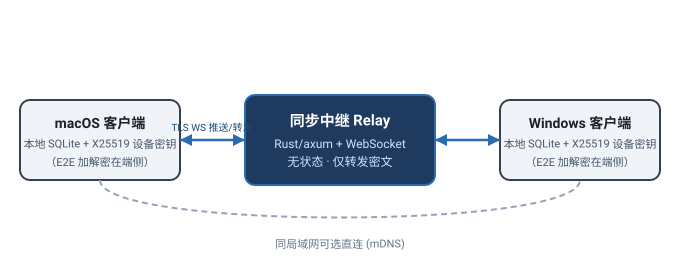
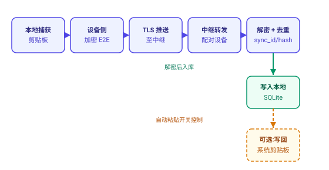
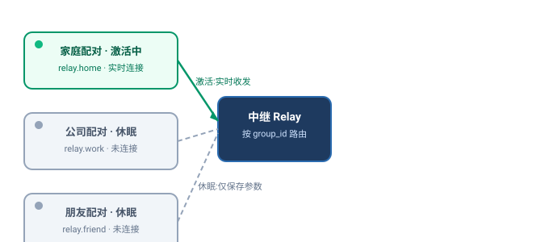
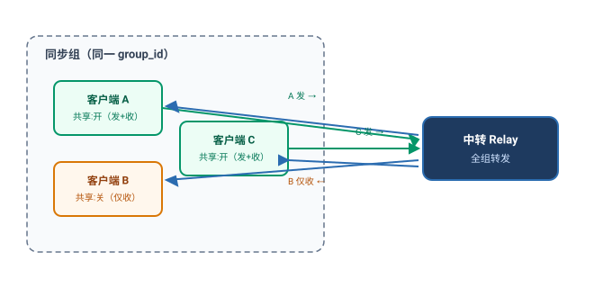

# ClipStack 跨设备同步 · 技术设计文档

> 状态：设计稿（待实施）
> 日期：2026-08-07
> 范围：跨电脑(跨网络 / 跨 NAT)剪贴板同步的整体技术路线、协议、数据模型与实施计划
> 关联文档：`clipstack-development-plan.md`(M11 未来扩展)、`clipstack-packaging.md`、`clipstack-build-steps.md`

---

## 一、背景与目标

ClipStack 当前是 **Tauri 2 + React + Rust + SQLite** 的本地优先、隐私可控剪贴板管理器，默认无云端同步（`clipstack-development-plan.md` 的 M11 将「多设备云同步」列为未来扩展）。本设计解决：

- **跨电脑复制粘贴**：A 机复制，B 机秒粘贴，跨越不同网络与 NAT。
- **组内共享**：多台设备组成一个「组」，组内共享剪贴板内容。
- **发布/接收分离**：每台客户端可独立关闭「把本机数据共享出去」，只有开启共享的客户端才对外发布；接收恒开。
- **隐私不打折**：内容端到端加密，中继服务器只转发密文，看不到明文。

### 关键约束

| 维度 | 要求 |
|---|---|
| 实时性 | 复制后其他设备近实时收到（推送，非轮询） |
| 敏感性 | 剪贴板含密码 / token，必须 E2E 加密 |
| 内容类型 | 文本 / 链接 / 代码 / 图片 / 文件（文件带大小上限） |
| 冲突 | 多端同时复制需统一顺序，避免列表乱序 |
| 技术栈 | 复用 Tauri 2 + Rust + SQLite，**不引入 Node 运行时** |
| 部署 | 中继可自托管，客户端无需公网 IP / 端口映射 |

---

## 二、总体技术路线

**选定方案：自托管中继（clipstack-relay）+ 端到端加密（E2E）+ 实时粘贴。**

| 候选路线 | 判断 |
|---|---|
| **中继 + E2E（采用）** | Rust 中继只转发密文、不落库、可自托管 Docker，隐私与实时性兼得 |
| 托管 BaaS（Supabase / Firebase） | 最快，但明文 / 密钥在第三方，违背隐私定位 |
| 纯 P2P（libp2p） | 无服务器，但 NAT 穿透痛苦，对称 NAT 必失败，仍需中继兜底 |
| 云盘文件同步（iCloud / Dropbox） | 实现简单，但非实时、易冲突、文件路径跨机失效 |

**核心抽象**：把每次复制当作一条**不可变事件（append-only log）**，而非改写同一条状态。每条目带全局唯一 `sync_id`、来源 `device_id`、`lamport` 逻辑时钟与 `hash`；多端复制是追加，冲突几乎消失——排序靠 `(lamport, device_id)`，去重靠 `hash` / `sync_id`。

### 架构拓扑



### 一次跨设备复制的数据流



---

## 三、同步数据模型（逻辑）

线上传输的「同步信封」：

```
SyncEnvelope {
  sync_id:    uuid            // 条目全局唯一 id
  device_id:  string          // 来源设备
  group_id:   string          // 所属组（= 配对配置）
  lamport:    u64             // 逻辑时钟，用于排序
  kind:       string          // text | link | code | image | file
  hash:       string          // 内容去重
  nonce:      [u8;24]         // XChaCha20 nonce
  ciphertext: [u8]            // 加密后的 ClipboardItem
}
```

- **排序**：`(lamport, device_id)` 决定全局顺序。
- **去重**：`hash` / `sync_id` 命中即跳过，避免回环与重复。
- **回环防护**：接收条目写库时标 `is_remote = 1`，本地捕获推送路径不处理 `is_remote` 条目，避免转发死循环。

---

## 四、组与配置模型（多配置单激活）

将一次配对抽象为一个**同步配置（Profile）**，持久保存：

- 名称（如「家庭」「公司」「朋友」）
- 中继地址 `relay_url`
- 群组 `group_id`（中继按它路由）
- **群组对称密钥**（配对时 ECDH 协商，落库时由本机设备密钥包装加密）
- 成员设备列表（`device_id` + 公钥 + 名称）
- **`share_out`**：本组内是否发布本机剪切板（见第六节）

**多个 Profile 并存于本地，同一时刻仅一个为激活态**：

- 只有激活态建立实时 WebSocket、用其群组密钥收发。
- 休眠配置仅保留参数，不连不收。
- 切换激活 = 断开旧 WS、用新密钥连新中继（`is_active` 互斥）。



**密钥安全**：群组密钥不裸存，用本机密钥（系统钥匙串 `keyring-rs`）做 AES-GCM 包装后存 `wrapped_key`；激活时拆封进内存，进程退出即清。换机 / 重装需重新配对或由同组其他设备「邀请」再协商，密钥本身不跨设备同步。

---

## 五、网络可达性：两个均无公网 IP 的网络如何互通

在选定的中继架构下，**两端都在 NAT 后、都没有公网 IP 是默认且已解决的场景**：客户端主动向外发起 WebSocket（TLS，目标 443），NAT 只挡入站、不挡出站。因此两端无需公网 IP、无需端口映射。

**唯一条件：中继本身需具备公网可达地址**。获取方式：

| 方式 | 中继主机是否需要公网 IP | 说明 |
|---|---|---|
| VPS / 云服务器 | 需要（云厂商直接给） | 最省心，`clipstack-relay` Docker 镜像直接跑 |
| **Cloudflare Tunnel** | **不需要** | 免费，中继在内网即可，靠出站隧道暴露，无需端口映射 |
| ngrok / frp | 不需要 | 类似穿透，适合临时 / 自托管 |
| Tailscale / WireGuard | 不需要 | 把多机拉入私有组网，走虚拟地址互访 |

> 推荐自托管路线：**中继跑在家内网 + Cloudflare Tunnel 暴露**，零公网 IP、零端口映射，且数据只在你的中继上过（全是 E2E 密文）。

若坚持「完全不要中继」的纯 P2P，则需 STUN/ICE，对**对称型 NAT**（4G / 蜂窝 / 很多企业网）几乎必失败，失败时只能回退到 TURN 中继（仍需公网 IP）。结论：只要两端都是对称 NAT，就不可能彻底摆脱一个具备公网可达性的服务器。

---

## 六、组内发布 / 接收分离（share_out）

需求要点：组内共享剪切板；但每台客户端可独立关闭「把本机数据共享出去」，只有开启共享的客户端才对外发布。

**两个独立通道**：

- **接收（receive）**：只要该组处于激活态，本机**始终接收**组内他人发布的共享内容并入库（自动粘贴仍由既有总开关控制）。
- **发布（publish）**：由本机 `share_out` 开关控制。关闭后，本机**不再往外发**自己的剪贴板，但**照样收**他人的共享。



**行为细节**：

- 关闭共享 = 停止**未来**发布；已发到对端的历史**无法撤回**（隐私提示：关共享不能抹掉别人机器上已有的副本，UI 需说清）。
- 文件沿用 **25MB 默认上限**（可在组内配置），超限不发布、仅本机保留。
- 接收恒开意味着：即使本机关共享，仍接收并存储组内其他人的共享（可选是否自动粘贴）。

---

## 七、clipstack-relay 详细设计

### 7.1 定位

常驻 WebSocket 服务，负责把加密信封在同 `group_id` 设备间转发，并在对端离线时暂存最近 N 条密文用于补发。**永远看不到明文、不解密、不存明文、不跑冲突合并**（合并在客户端）。核心原则：**E2E-blind（盲中继）**。

### 7.2 仓库布局

现有 `clipstack` 是独立 Tauri crate，尚未引入 tokio / tungstenite。新增两个独立 crate（用 path 依赖，无需改造成 workspace）：

```
clipboards/
├─ clipstack-protocol/   # 共享协议库（纯类型，无 IO）
│   └─ Cargo.toml
├─ clipstack-relay/      # 中继服务（可独立 Docker 化）
│   ├─ Cargo.toml
│   ├─ Dockerfile
│   └─ src/main.rs
└─ clipstack/src-tauri/  # 客户端：新增 sync.rs，依赖 clipstack-protocol + tokio-tungstenite + rustcrypto
```

`clipstack-protocol` 放双方共用的信封与消息类型，避免契约漂移。

### 7.3 线上消息协议

```rust
// 客户端 → 中继
#[serde(tag = "t", rename_all = "snake_case")]
enum ClientMsg {
    Hello { device_id: String, group_id: String, token: String, last_seq: u64 },
    Clip  (SyncEnvelope),   // 加密剪贴板条目
    Ack   { sync_id: String },
    Ping,
    Bye,
}

// 中继 → 客户端
#[serde(tag = "t", rename_all = "snake_case")]
enum ServerMsg {
    Welcome { device_id: String, peers: Vec<String> },
    Clip    (SyncEnvelope),
    Catchup (Vec<SyncEnvelope>),  // 重连补发
    Presence { device_id: String, online: bool },
    Pong,
    Error   { code: u16, msg: String },
}
```

### 7.4 连接生命周期（鉴权）

1. 客户端连上 `wss://relay.xxx` 后先发 `Hello`（`device_id` + `group_id` + `token` + `last_seq`）。
2. 中继校验 `token == HMAC(group_id, RELAY_SECRET)`（`RELAY_SECRET` 是中继环境变量，一次性设定）。**中继无状态、不存成员名单**，只靠能力令牌放行，依旧看不到明文。
3. 通过 → 把 socket 登记进 `注册表[group_id]`，回 `Welcome`（含当前同组在线 `peers`）；若 `last_seq` 落后则回 `Catchup`。
4. 客户端周期性发 `Ping`（≤30s，专门对付 Cloudflare 免费档 100s 空闲断开）；中继回 `Pong`，超时（如 90s）未活动则踢线。

> `token` 与 `group_id` 编进配对二维码，扫到的另一端天然持有；中继只做准入，不做内容解读。

### 7.5 路由与离线处理

- **路由**：收到 `Clip` → 查 `注册表[group_id]`，转发给该组除发送者外的所有在线设备；同时追加进**离线缓冲**（按 `group_id` 的环形队列，默认保留最近 256 条密文，带单调 `seq`）。
- **补发**：设备重连时 `Hello.last_seq` 告知最后收到序号，中继从缓冲回 `Catchup` 补齐；离线太久缓冲已滚动覆盖则仅丢失最旧部分（可接受，极端情况用重新配对兜底）。
- 缓冲**只存密文**，中继重启即清空；生产如需跨重启补发可换 Redis / 磁盘（仍是密文）。

### 7.6 安全与限流（中继侧）

- 永远不解密；E2E 已兜底内容机密性。
- 准入：`token`（HMAC）校验；可选在前面叠 **Cloudflare Access**（mTLS / 服务令牌）做默认拒绝。
- 限流 / 上限：`MAX_ENVELOPE_BYTES`（建议 32MB，覆盖 25MB 文件上限）、单组设备上限（如 16）、单设备速率、全局连接数。
- 对外仅暴露 WS 端口 + `/healthz`，源站 IP 由 Cloudflare 隐藏。

### 7.7 部署

- **Dockerfile**：多阶段（rust:slim 编译 → debian-slim 运行），环境变量 `RELAY_PORT` / `RELAY_SECRET` / `BUFFER_SIZE`。
- **暴露**：经 Cloudflare Tunnel（`service: http://localhost:8787`，WS 升级自动处理），中继主机无需公网 IP。
- **HA**：同 `RELAY_SECRET` + 同 `token` 在多机跑副本，Cloudflare 自动负载 / 故障转移；缓冲各自独立（副本间不共享），属可接受权衡。

### 7.8 可观测性

- `tracing` 结构化日志（连接 / 路由 / 拒绝）。
- `GET /healthz` → 200，供 Tunnel / Docker 健康检查。
- 可选 Prometheus 指标（在线连接数、消息速率、缓冲占用）。

### 7.9 依赖与规模

- 体量小：核心约 600–900 行 Rust；依赖 `tokio` / `tokio-tungstenite` / `axum`（或 hyper） / `serde` / `sha2`（HMAC） / `tracing`。
- **中继无需 rustcrypto**（它不解密）。

---

## 八、Cloudflare Tunnel 部署（中继暴露）

### 8.1 原理

`cloudflared` 守护进程主动向外建立出站长连接（2026 起默认 QUIC / HTTP3），外部访问你分配的域名时流量经 Cloudflare 边缘倒灌进隧道到达本地服务。**不需要公网 IP、不需要端口映射、不需要 DDNS**；Cloudflare 自动签发 TLS，对外即标准 `wss://`。

### 8.2 免费额度与坑点

- 免费档：隧道数 / 连接数 / 带宽均不限；自带 DDoS 防护与 anycast 就近接入。
- **WebSocket 100 秒空闲断开**：免费档会在 WebSocket 空闲约 100s 后重置。对策是应用层心跳——relay 与客户端双向 `Ping/Pong` 间隔 < 60s（如 30s）。做好心跳后无感，无需升级 Pro。
- 免费档另有约 100 请求/秒并发上限（个人够用）与 100MB 单文件上传上限（与 25MB 文件同步不冲突）。

### 8.3 部署步骤

```bash
# 1. 安装 cloudflared
brew install cloudflared
# 2. 登录并绑定域名（NS 需在 Cloudflare）
cloudflared tunnel login
# 3. 建命名隧道（生产用，勿用一次性 Quick Tunnel）
cloudflared tunnel create clipstack-relay
# 4. 写配置 ~/.cloudflared/config.yml
tunnel: <tunnel-id>
credentials-file: /path/to/<tunnel-id>.json
ingress:
  - hostname: relay.yourdomain.com
    service: http://localhost:8787     # WS 升级由 cloudflared 自动处理
  - service: http_status:404           # 兜底规则，必须放最后
# 5. 建 DNS 记录（自动加 CNAME）
cloudflared tunnel route dns clipstack-relay relay.yourdomain.com
# 6. 常驻运行（开机自启：systemd / launchd / Windows Service）
cloudflared tunnel run clipstack-relay
```

客户端把 Profile 的 `relay_url` 填成 `wss://relay.yourdomain.com` 即可。

### 8.4 安全加固（可选）

- **Cloudflare Access**（Zero Trust，50 用户内免费）：在隧道前加默认拒绝，用邮箱 / OIDC / 服务令牌 / mTLS 校验连入者。对 ClipStack 属锦上添花（内容已 E2E 加密），但能挡掉扫描与滥用。
- 不建议把 Quick Tunnel（随机子域、限测试）用于生产，用命名隧道 + 自有域名。

### 8.5 局限

- 引入 Cloudflare 作为「可达性」第三方（数据内容仍由你 E2E 掌控）。
- 中继主机须一直运行且 `cloudflared` 在跑；可用同 token 多机副本做 HA。
- 若连第三方可达性都不想依赖，替代为 VPS（给公网 IP）或 Tailscale Funnel。

---

## 九、客户端集成要点

- **`sync.rs`**（新增 Rust 模块，后台 `tokio` 任务）：
  - 维护到激活组中继的 WebSocket，断线指数退避重连。
  - **捕获路径**：本地 clipboard 钩子触发 → 若当前激活组 `share_out == 1` → 加密 → 入 `sync_queue` 并立即推送；`share_out == 0` 只入库本机、不推送。
  - **接收路径**：收到 `Clip` → 解密 → 按 `hash` / `sync_id` 去重 → 写 `history`（标 `is_remote = 1`，不触发回环）→ 若开启自动粘贴则经 `arboard` 写回系统剪贴板。
- **密钥管理**：`keyring-rs` 存本机设备密钥；群组密钥经其包装存 `wrapped_key`。
- **配对**：「添加设备」生成临时配对码 + 显示 QR（含本机公钥、`relay_url`、`token`），另一端扫码完成 ECDH → 群组对称密钥。
- **与现有模块衔接**：捕获复用 `clipboard.rs`；持久化复用 `db.rs`（见第十节增量）；UI 复用 React + Zustand。

---

## 十、数据模型（SQLite 增量）

`history` 增加列：`sync_id TEXT`、`origin_device TEXT`、`lamport INTEGER`、`profile_id TEXT`、`is_remote INTEGER`。

```sql
-- 同步配置（= 组）：多配置并存，仅一个激活
sync_profiles(
  id          TEXT PRIMARY KEY,   -- profile uuid
  name        TEXT,               -- 显示名（家庭/公司/朋友）
  relay_url   TEXT,               -- 中继地址（wss://...）
  group_id    TEXT,               -- 中继路由用
  wrapped_key BLOB,               -- 群组密钥，经本机密钥包装
  is_active   INTEGER DEFAULT 0,  -- 全局唯一 true
  share_out   INTEGER DEFAULT 1,  -- 该组内是否发布本机剪切板
  created_at  INTEGER
);

-- 组内成员设备
sync_members(
  profile_id TEXT,
  device_id  TEXT,
  name       TEXT,
  public_key BLOB,
  PRIMARY KEY (profile_id, device_id)
);

-- 可选：离线待发表 / 本机同步元信息
sync_queue(id TEXT, envelope_blob BLOB, created_at INTEGER);
sync_meta(key TEXT PRIMARY KEY, value TEXT);   -- device_id / 当前 lamport / 已收最大 seq
```

---

## 十一、命令契约（Tauri commands）

| 命令 | 说明 |
|---|---|
| `list_profiles` | 列出所有同步配置（含激活态、share_out、成员数） |
| `activate_profile(profile_id)` | 切换激活（重连 WS + 换钥，互斥） |
| `add_device(profile_id, qr_payload)` | 在指定组内配对新设备 |
| `remove_profile(profile_id)` | 删除配置（取消配对） |
| `rename_profile(profile_id, name)` | 重命名 |
| `toggle_share_out(profile_id, bool)` | 切换该组发布开关 |
| `get_sync_status()` | 连接状态、在线成员、最近同步时间 |

命名沿用既有约定：`动词_名词`，返回 `{ ok, data?, error? }`。

---

## 十二、分阶段实施计划

| 阶段 | 交付物 | 验证方式 |
|---|---|---|
| **P1 协议与加密核心** | `clipstack-protocol`（信封 + 消息类型，带单测）；加密 / 解密、去重、Lamport 排序、回环防护、多配置密钥隔离 | 两个内存 SQLite 离线模拟双端收发，`cargo test` |
| **P2 中继服务** | `clipstack-relay`（axum + ws、Hello 鉴权、路由、离线缓冲、心跳）、Dockerfile、Cloudflare Tunnel 部署说明 | `cargo test` + 本地双客户端连同一中继 |
| **P3 客户端集成** | `sync.rs` 后台 WS 任务、捕获即推送（受 `share_out` 门控）、接收即入库、激活切换重连换钥 | 两台机器实机互拷 |
| **P4 UX 与文件** | 配置列表 + 激活切换 + 重命名 / 删除 + 「共享本机剪切板」开关 + 组来源标识 + 文件大小上限（默认 25MB） | 手动验收 |
| **P5 分发** | 中继 Docker 镜像 + 设置页可填 `relay_url` + Tunnel 文档 | 文档 + 打包 |

---

## 十三、安全与隐私总结

- **盲中继**：中继只转发密文，被攻破也无明文；中继无状态、不存成员。
- **密钥本地**：群组密钥由系统钥匙串包装存储，不跨设备同步。
- **E2E 兜底**：即使流量过 Cloudflare 边缘，其看到的也只是 TLS + 应用层双层密文。
- **发布可控**：`share_out` 是纯本地开关，不经过网络。
- **文件上限**：发布前即在客户端拦截，大文件不出本机。
- **已发不可撤回**：关闭共享仅停发未来内容，已发到对端的副本无法回收（UI 需明示）。

---

## 十四、开放问题与后续

- **多组同时接收**：当前单激活（一次连一个组）。若需同时接收多组，中继已支持多 `group_id`，客户端为每个激活组各开一条 WS 即可，发布开关仍每组建。
- **大文件传输策略**：当前 25MB 上限内走中继加密传输；超上限降级为「仅元数据 + 本机不可用」占位。后续可评估分片 / 直传。
- **撤回（recall）**：是否需要「从组内撤回已发条目」能力（需中继支持按 `sync_id` 撤销广播）。
- **冲突的人工处理 UI**：正常靠 Lamport 自动排序，极端乱序时可提供手动置顶 / 时间线视图。
