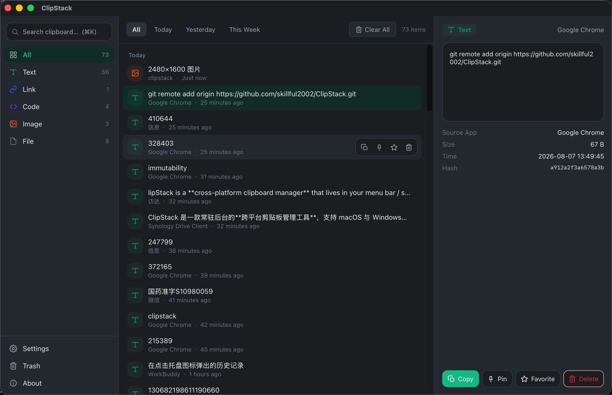
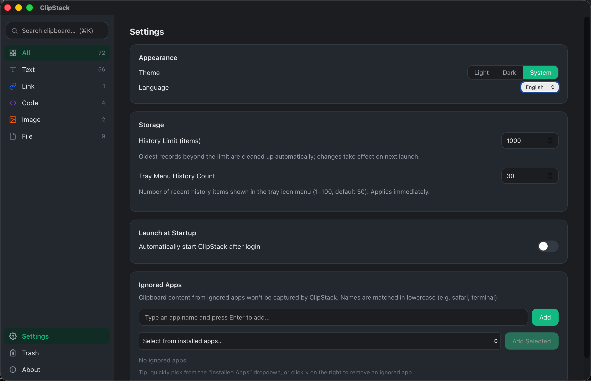

# ClipStack

> 跨平台剪贴板管理器 · 让「复制过就找不到」成为过去。

ClipStack 是一款常驻后台的**跨平台剪贴板管理工具**，支持 macOS 与 Windows。它实时捕获你复制过的文本、链接、代码、图片与文件，提供历史检索、智能分类与一键复用，让你的剪贴板从此「可回溯、可搜索、可复用」。

支持多种语言：简体中文、繁体中文、英文、日文、德文、法文。

- 应用标识：`tech.newxin-clipstack.app`
- 当前版本：`0.2.0`
- 技术栈：Tauri 2 + React 18 + TypeScript + Vite + Rust（SQLite 持久化）

---

## 一、核心特性

- **实时捕获（事件驱动）**：基于系统剪贴板变更事件监听（macOS 用 `NSPasteboard.changeCount` 比对，非轮询），低耗电、低开销；支持纯文本、链接、代码、图片、文件五类内容。
- **历史管理**：倒序列表、按日分组；「置顶」恒靠前、「收藏」独立标记，重要条目不再沉底。
- **回收站**：删除进入回收站，可恢复或彻底清空；图片与回收站内容均可**预览**。
- **检索与过滤**：全文搜索（`⌘K` / `Ctrl+K` 聚焦）、分类切换（全部 / 文本 / 链接 / 代码 / 图片 / 文件）、时间筛选（今天 / 昨天 / 本周 / 全部）。
- **一键复制**：点击或回车即可把条目复制回系统剪贴板。文本 / 链接 / 代码直接写入文字；**图片**以 PNG 写回，可在任意支持处粘贴为图片；**文件**以真实文件 URL 写回，可在访达 / 文件管理器中粘贴为文件本身（库内仅保存文件路径，不入库存放文件内容）。
- **菜单栏 / 系统托盘**：macOS 菜单栏、Windows 托盘常驻；下拉展示最近历史，每条前带与首界面分类一致的彩色类型图标，一击即取；条数可在设置中配置（默认 30，文件类型不在托盘历史中展示）。
- **首启引导与常驻**：首次运行自动打开设置页完成初始化；非首次仅驻留菜单栏 / 托盘（macOS 无前台窗口时不显示 Dock 图标），关闭主窗口仅隐藏不退出。
- **全局快捷键**：`⌘⇧V` / `Ctrl Shift V` 唤起或隐藏主窗口；关闭主窗口改为隐藏，应用常驻托盘不退出。
- **外观主题**：浅色 / 深色 / 跟随系统（默认「跟随系统」，使用 Tauri 原生主题 API）。
- **隐私围栏（忽略应用）**：可手动输入或从「已安装应用」选择需要跳过的应用（如密码管理器），命中即不捕获。
- **多语言界面**：内置 简体中文 / 繁體中文 / English / 日本語 / Deutsch / Français，跟随系统或手动切换。
- **轻量**：后端为 Rust、前端复用系统 WebView，**无 Node 运行时**，常驻内存远低于同类 Electron 工具。
- **局域网共享（LAN 同步）**：同一局域网（WiFi / 有线）内的多台设备可端到端加密互享剪贴板，无需服务器、不上云。在「设置 → 局域网共享」中配置共享组 / 共享密钥 / 端口、文件大小上限、共享类型过滤与手动对端；托盘菜单「共享」项一键开关，左侧圆点指示状态。支持大文件与 macOS 目录包（如 `.rtfd`）完整互传，收到的图片与文件可「另存为」到本机。

---

## 二、支持平台

| 平台 | 形态 | 状态 |
|---|---|---|
| macOS | 菜单栏应用（`.dmg` / `.app`） | ✅ 支持 |
| Windows | 系统托盘应用（`.msi`） | ✅ 支持 |
| Linux | 托盘应用 | 可选（规划中） |

> macOS 首次使用可能需要在「系统设置 → 隐私与安全性 → 辅助功能」中授予 ClipStack 权限，以保证剪贴板监听与全局快捷键正常工作。

---

## 三、安装与运行

### 方式一：下载安装包（推荐）

- **macOS**：下载 `.dmg`，拖入「应用程序」即可。
- **Windows**：下载 `.msi`，按向导安装。

> 正式分发版本需经开发者签名与公证；未签名的安装包在他人机器上可能被 Gatekeeper / SmartScreen 拦截。详见 [`clipstack/docs/clipstack-packaging.md`](clipstack/docs/clipstack-packaging.md)。

### 方式二：从源码构建

前置依赖：Node ≥ 22、Rust 工具链（rustup + cargo）、macOS 需 Xcode Command Line Tools。

```bash
git clone <repo-url>
cd clipstack
npm install
npm run tauri build      # 产出安装包：macOS → .dmg/.app，Windows → .msi
```

开发预览：

```bash
npm run tauri dev        # 启动完整 Tauri 应用（前端 + 原生窗口）
```
### 方式三：直接下载二进制代码
在Release页面，可以看到打包好的二进制代码，直接下载安装即可。

> 注：macOS 首次使用可能需要在「系统设置 → 隐私与安全性 → 辅助功能」中授予 ClipStack 权限，以保证剪贴板监听与全局快捷键正常工作。
---

## 四、快速上手

1. 启动 ClipStack，它会在菜单栏 / 托盘常驻。
2. 像往常一样复制内容（`⌘C` / `Ctrl C`）——ClipStack 会自动记录。
3. 点菜单栏 / 托盘图标下拉最近历史,并可打开主窗口、设置窗口等。
4. 鼠标放在条目上，可可置顶、收藏、删除（删除进入回收站，可恢复）。

### 忘记主密码？

如果你忘记了 ClipStack 的主密码、无法解锁应用：**退出程序，然后重新启动程序**，在主窗口打开后进入「设置 → 安全」，点击「清除主密码」即可移除应用锁（无需输入旧密码）。清除后应用将不再要求密码即可解锁；你的剪贴板数据仍以本地密钥加密存储，不受影响。

---

## 五、界面预览

> 以下为 ClipStack 实际运行截图。

**主界面**：左侧分类导航（全部 / 文本 / 链接 / 代码 / 图片 / 文件，含计数）；中间按时间分组的历史列表与工具栏（时间筛选、清除全部）；右侧为选中条目的详情与操作（复制 / 置顶 / 收藏 / 删除）。



**设置界面**：外观（主题、语言）、存储（历史上限、托盘菜单历史条数）、开机自启、忽略的应用等配置。



---

## 六、技术架构

| 层 | 选型 | 说明 |
|---|---|---|
| 框架 | Tauri 2.x | 轻量跨平台，不打包浏览器内核 |
| 前端 | React 18 + TypeScript + Vite | 生态成熟，类型安全 |
| 状态 | Zustand | 单一来源，轻量 |
| 样式 | CSS 变量设计 Token | 主题统一驱动 |
| 后端 | Rust（edition 2021） | 捕获 / 托盘 / 快捷键 / 数据库 |
| 数据库 | SQLite（rusqlite） | 本地优先、隐私可控 |
| 插件 | global-shortcut / tray-icon / dialog / autostart / clipboard-manager / opener / process | 原生能力封装 |

### 项目结构

```
clipboards/
├── clipstack/                # ClipStack 软件工程
│   ├── src/                  # 前端（React + TS）
│   │   ├── components/       # 侧边栏 / 历史列表 / 详情面板 / 设置 / 回收站
│   │   ├── store/            # Zustand 状态
│   │   ├── lib/              # invoke 封装、actions、theme、i18n
│   │   └── styles/           # 设计 Token 与基础样式
│   ├── src-tauri/            # 后端（Rust）
│   │   └── src/              # clipboard / db / commands / tray / models ...
│   └── README.md             # 技术开发参考（构建、目录、规范）
└── docs/                     # 规划与构建文档
    ├── clipstack-development-plan.md
    ├── clipstack-build-steps.md
    └── clipstack-packaging.md
```

---

## 七、数据模型（SQLite）

本地数据库包含四张表：`history`（历史）、`trash`（回收站）、`settings`（设置）、`ignored_apps`（忽略应用）。

| 表 | 关键字段 | 说明 |
|---|---|---|
| history | content_type / content_text / content_blob / source_app / hash / is_pinned / is_favorite / created_at | 剪贴板条目，`hash` 用于去重 |
| trash | 同 history + deleted_at | 软删除，可恢复 |
| settings | key / value | 外观、容量、自启等 |
| ignored_apps | name | 按应用名（大小写不敏感）跳过捕获 |

`content_blob` 的存储策略：图片存 PNG 二进制；**文件存 JSON 路径数组**（不含文件内容），`content_text` 同时保存以 `, ` 拼接的完整路径用于列表展示。所有数据均存储于本地，默认无云端同步，隐私可控。其中 `content_text` / `content_blob` 两列已加密存储（应用层 AES-256-GCM），其余字段保持明文以便查询。

---

## 八、面向开发者

完整的技术参考、开发与构建命令、编码规范、数据模型与打包签名流程，请参阅工程内的文档：

- [`clipstack/README.md`](clipstack/README.md) — 技术开发参考（环境、命令、目录、主题、忽略应用、进度）
- [`docs/clipstack-development-plan.md`](docs/clipstack-development-plan.md) — 产品定位、功能规划、技术架构、编码规范、里程碑
- [`docs/clipstack-build-steps.md`](docs/clipstack-build-steps.md) — 逐阶段开发步骤与进度记录
- [`docs/clipstack-packaging.md`](docs/clipstack-packaging.md) — 本地构建、macOS 签名+公证、Windows `.msi`、CI

质量门禁：Rust `cargo test`（50/50）、`cargo clippy --all-targets`（0 告警）；前端 `npm run build`（tsc + vite）通过。

---

## 九、已知限制

- 正式的签名 / 公证 / 出包需在开发者本机或 CI 完成，沙箱环境无法执行。
- macOS 菜单栏托盘图标默认按模板图渲染（可能偏单色），属原生行为；托盘菜单项图标为彩色（由 `src-tauri/icons/gen_type_icons.py` 生成）。

---

## 十、许可证

详见仓库许可证文件。

---

## 十一、关注我们

欢迎关注微信公众号「码途山海」，获取大模型、AI 工具与独立开发的最新实践与资讯。


文件共享时：重复的文件，在文件后缀之间加带小括号的序号，而不是在文件名称最后面增加
主快捷键自定义：CTRL+SHIFT+V可以修改
按来源过滤：(已经支持)，可以增加最常见的前5个来源在“文件”之下，并增加一条横线以便进行区分
敏感词：判断方法完善
按时间过滤：增加本月以及指定日期
链接：悬浮菜单增加用浏览器打开，详情下面按钮处增加“打开”
图片与文件：详细下面按钮处增加“另存为”
内容太多时：滚动加载
图片在点详情时才获取实际内容，以加快显示速度
